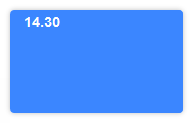
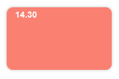

# Customization

## Setting variables

To customize the calendar import the default `Sass` variables, set your variables and then import the rest of the styles.   
Check all the available variables [below](#available-variables)

```scss
//  Import the default variables
@import "~v-calendar-scheduler/scss/variables";

//  Set your variables
$v-cal-event-bg: salmon; //  Event background color
$v-cal-event-border-radius: 10px; //  Events border radius (all 4 corners)

//  Import the rest
@import "~v-calendar-scheduler/scss/main";
```

#### Result:

| Before                                | After                                 |
| ------------------------------------- | ------------------------------------- |
|  |  | 

## Available variables

### Basic


| Variable                        |  Description                                                                       | Default   |
| ------------------------------- | ---------------------------------------------------------------------------------- | --------- |
| `$v-cal-font-color`             | Sets the text color for the `Title`, month days, and week and day times.           | `#4D4F5C` |
| `$v-cal-title-font-size`        | Sets the `Title` font size.                                                        | `18px`    |
| `$v-cal-body-bg`                | Sets the background color for the calendar body (Including the buttons at the top. | `$white`  |
| `$v-cal-body-shadow`            | Sets the box shadow for the calendar body (Including the buttons at the top.       | `0 2px 6px rgba(0,0,0,.04)`  |
| `$v-cal-content-border-color`   | Sets the border of the calendar main section. Applies to all views.                | `#EAF0F4`  |

### Calendar head

| Variable                        |  Description                                                                       | Default    |
| ------------------------------- | ---------------------------------------------------------------------------------- | ---------- |
| `$v-cal-days-head-bg`           | Sets the background of the calendar head, where the days are shown.                | `#F5F6FA`  |
| `$v-cal-days-head-border-color` | Sets the border color of the calendar head, bottom border only.                    | `#EAF0F4`  |
| `$v-cal-days-head-color`        | Sets the text color of the calendar head (days names).                             | `#A3A6B4`  |
| `$v-cal-days-head-font-size`    | Sets the font size of the calendar head (days names).                              | `.75rem`   |
| `$v-cal-days-head-font-weight`  | Sets the font weight of the calendar head (days names).                            | `bold`     |

### Days - All views

| Variable                        |  Description                                                                                            | Default                |
| ------------------------------- | ------------------------------------------------------------------------------------------------------- | ---------------------- |
| `$v-cal-day-bg`                 | Sets the background color for the days.                                                                 | `$white`               |
| `$v-cal-day-border-color`       | Sets the border color for the days (`month`) and the time blocks (`week`, `day`).                       | `#EAF0F4`              |
| `$v-cal-day-diff-month-color`   | Sets the background color for the days that belong to a month different from the active one.            | `rgba(67, 66, 93, .3)` |
| `$v-cal-day-today-bg`           | Sets the background color `today`.                                                                      | `#F5F6FA`              |
| `$v-cal-day-disabled-bg`        | Sets the background color for disabled days when using `min-date` or `max-date`. [Learn more](/guide/config.md#available-settings-props). | `#f0f0f0`              |
| `$v-cal-day-disabled-color`     | Sets the text color for disabled days when using `min-date` or `max-date`. [Learn more](/guide/config.md#available-settings-props). | `#b0b0b0`              |

### Days - Month view only

| Variable                        |  Description                                                                       | Default    |
| ------------------------------- | ---------------------------------------------------------------------------------- | ---------- |
| `$v-cal-day-number-font-size`   | Sets the font size for the dates.                                                  | `.75rem`   |
| `$v-cal-day-number-padding`     | Sets the padding for the dates. (Just the numbers)                                 | `10px`     |
| `$v-cal-day-month-height`       | Minimum height for the days.                                                       | `140px`    |
| `$v-cal-day-month-hover-bg`     | Day background color on `hover`.                                                   | `#fcfcfc`  |

### Times - Week and day views only

| Variable                     |  Description                                                                       | Default         |
| -----------------------------| ---------------------------------------------------------------------------------- | --------------- |
| `$v-cal-time-block-bg`       | 'Time block' background color.                                                     | `transparent`   |
| `$v-cal-time-block-hover-bg` | 'Time block' background color on `hover`.                                          | `#fcfcfc`       |

### Times column - Week and day views only

| Variable                     |  Description                                                                       | Default         |
| -----------------------------| ---------------------------------------------------------------------------------- | --------------- |
| `$v-cal-times-bg`            | Times column background color.                                                     | `$white`        |
| `$v-cal-times-font-size`     | Times column font size.                                                            | `.8125rem`      |
| `$v-cal-times-border-color`  | Times column border color.                                                         | `#EAF0F4`       |

### Events

| Variable                     |  Description                                                                       | Default         |
| -----------------------------| ---------------------------------------------------------------------------------- | --------------- |
| `$v-cal-event-bg`            | Event background color.                                                            | `#3B86FF`       |
| `$v-cal-event-color`         | Event text color.                                                                  | `$white`        |
| `$v-cal-event-border-radius` | Events border radius (all 4 corners).                                              | `4px`           |

### Time Marker

| Variable                     |  Description                                                                       | Default         |
| -----------------------------| ---------------------------------------------------------------------------------- | --------------- |
| `$v-cal-time-marker-color`   | Time marker color (`week` and `day` views).                                        | `#3B86FF`       |

### Buttons

| Variable                        |  Description                                                                       | Default                     |
| ------------------------------- | ---------------------------------------------------------------------------------- | --------------------------- |
| `$v-cal-button-bg`              | Buttons background color.                                                          | `$white`                    |
| `$v-cal-button-shadow`          | Buttons shadow.                                                                    | `0 2px 3px rgba(0,0,0,.05)` |
| `$v-cal-button-padding`         | Buttons padding.                                                                   | `8px 18px`                  |
| `$v-cal-button-border-color`    | Buttons border color.                                                              | `#D7DAE2`                   |
| `$v-cal-button-border-radius`   | Buttons border radius.                                                             | `4px`                       |
| `$v-cal-button-active-bg`       | Button `is-active` background color.                                               | `$white`                    |
| `$v-cal-button-active-color`    | Button `is-active` text color.                                                     | `#3B86FF`                   |
| `$v-cal-button-hover-bg`        | Button `hover` background color.                                                   | `#fcfcfc`                   |
| `$v-cal-button-hover-color`     | Button `hover` text color.                                                         | `#3B86FF`                   |
| `$v-cal-button-disabled-bg`     | Button `:disabled` background color.                                               | `#f0f0f0`                   |
| `$v-cal-button-disabled-color`  | Button `:disabled` text color.                                                     | `#d0d0d0`                   |
| `$v-cal-button-disabled-cursor` | Button `:disabled` cursor.                                                         | `not-allowed`               |

### Dialog

| Variable                            |  Description                                       | Default                  |
| ----------------------------------- | -------------------------------------------------- | ------------------------ |
| `$v-cal-dialog-bg`                  | Dialog background (overlay).                       | `rgba(0,0,0,.3)`         |
| `$v-cal-dialog-card-bg`             | Dialog card background color.                      | `$white`                 |
| `$v-cal-dialog-card-max-width`      | Dialog card maximum width.                         | `500px`                  |
| `$v-cal-dialog-shadow`              | Dialog card shadow.                                | `0 0 6px rgba(0,0,0,.4)` |
| `$v-cal-dialog-header-padding`      | Dialog header padding.                             | `20px`                   |
| `$v-cal-dialog-header-border-color` | Dialog header border-color (bottom only).          | `#EAF0F4`                |
| `$v-cal-dialog-title-font-size`     | Dialog title font size.                            | `13px`                   |
| `$v-cal-dialog-close-width`         | Dialog close button width.                         | `18px`                   |
| `$v-cal-dialog-close-color`         | Dialog close button color.                         | `#BCBCCB`                |
| `$v-cal-dialog-body-padding`        | Dialog body padding.                               | `20px`                   |
| `$v-cal-field-border-radius`        | Dialog field border radius.                        | `4px`                    |
| `$v-cal-field-padding`              | Dialog field padding.                              | `10px 12px`              |
| `$v-cal-field-idle-border-color`    | Dialog idle field border color.                    | `#E8E9EC`                |
| `$v-cal-field-hover-border-color`   | Dialog `:hover` field border color.                | `#808495`                |
| `$v-cal-field-active-border-color`  | Dialog `:active`, `:focus` field border color.     | `#3B86FF`                |
| `$v-cal-dialog-footer-padding`      | Dialog footer padding.                             | `20px`                   |
| `$v-cal-dialog-footer-border-color` | Dialog footer border color (top only).             | `#EAF0F4`                |
