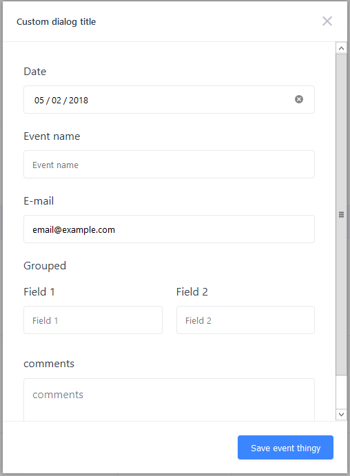

# Event model

The `Event` model represents an event in the calendar. The most basic instance consists of `date`, `startTime` and `endTime`.

It also contains some hidden logic that allows the calendar to perform validations and store some meta data **without** exposing this data to you, so the objects you pass to the calendar remain as you added them.

## Setting or adding events

To add your events to the calendar simply pass an array with your events to the `events` prop of the calendar.

```vue
<template>
  <v-scheduler :events="events"/>
</template>
<script>
  export default {
    data() {
      return {
        events: [
          {
            date: new Date()
          },
          {
            date: new Date(),
            startTime: "13:00",
            endTime: "15:00",
          }
        ]
      }
    }
  }  
</script>
```

You can pass events with just a `Date` object.  
If there is no `startTime` the event will show on the `all day` section of the `week` and `day` views. The `startTime` is also used to sort events with the same date on the `month` view.

If you pass an event **with** a `startTime` but **without** an `endTime` you will get an error.

The format for the times is `"HH:mm"`, using 24-hour.

::: tip
Any event you later to the array, as well as any event created using the [Event dialog](#event-dialog), will appear in the calendar automatically.
::: 

## Custom attributes

If you want to add more attributes to your events, like a name, simple add them to each event object.

```js
// ...
export default {
    data() {
      return {
        events: [
          {
            date: new Date(),
            startTime: "13:00",
            endTime: "15:00",
            name: "Date with David",
            comments: "MUST bring chocolate.",
            customAttribute: "I'm a custom attribute"
          }
        ]
      }
    }
}
// ...
```
## Setting the event display

By default the events on the calendar display only the `startTime` if any.  
If you want to display something else for each event, set the `event-display` prop on the calendar instance ([check available props](/guide/config.md#available-settings-props)).

The props takes a `String` as the key for the attribute you want to display. It can also take a callback function in case you need more control. This callback receives the event as a parameter and should return a `String` with the value you want to display.

#### Using a string as key:

```vue
<template>
  <v-scheduler :events="events" event-display="name" /> <!-- Using the custom attribute 'name' as display key. -->
</template>
<script>
  export default {
    data() {
      return {
        events: [
          {
            date: new Date(),
            startTime: "13:00",
            endTime: "15:00",
            name: "Date with David",
            comments: "MUST bring chocolate.",
            customAttribute: "I'm a custom attribute"
          }
        ]
      }
    }
  }  
</script>
```

#### Using a callback function:

```vue
<template>
  <v-scheduler :events="events" :event-display="eventDisplay" /> <!-- Using a callback function. -->
</template>
<script>
  export default {
    data() {
      return {
        events: [
          {
            date: new Date(),
            startTime: "13:00",
            endTime: "15:00",
            name: "Date with David",
            comments: "MUST bring chocolate.",
            customAttribute: "I'm a custom attribute"
          }
        ]
      }
    },
    methods: {
      eventDisplay(event) {
        return event.name + ' - ' + event.comments;
      }
    }
  }  
</script>
```

## Event dialog

The default, basic dialog looks like this:


If the user clicks on a date on the `month` view the dialog will populate the `Date` and leave the `Start Time` and `End Time` empty.   
If the user clicks on a time block on the `week` or `day` views the dialog will populate the `Date`, the `Start Time` and the `End Time`. 

### Dialog settings

To change any setting of the dialog, pass an object with your settings to the `event-dialog-config` prop of the calendar.

::: warning These settings are not global.
Remember that these settings work **per instance** only.
:::

| Setting            | Description                                                                                                           | Type          | Default          |
| ------------------ | --------------------------------------------------------------------------------------------------------------------- | ------------- | ---------------- |
| title              | Sets the dialog title.                                                                                                | String        | `'Create event'` |
| inputClass         | Additional classes for the dialog inputs. **Classes are added to input parent**, not the input itself.                | String        | `null`           |
| overrideInputClass | By default classes set with `inputClass` are **appended** to the default class. This setting removes default classes. | Boolean       | `false`          |
| createButtonLabel  | Text for the `Create` button of the dialog.                                                                           | String        | `'Create'`       |
| enableTimeInputs   | Toggles the `startTime` and `endTime` inputs.                                                                         | Boolean       | `true`           |
| fields             | Additional fields.                                                                                                    | Array[Object]. [Check Custom fields](#custom-fields). ||

### Custom fields

Each field consists of the following attributes:

::: warning Input type support
Checkboxes, radio and selects are **not** supported yet. This will be fixed in the next release.
:::

| Attribute | Description                                                                                                              | Type    | Default          | Required |
| --------- | ------------------------------------------------------------------------------------------------------------------------ | ------- | ---------------- | -------- |
| name      | Sets the name of the html input. It should match the name of the [custom attribute](#custom-attributes) you want to set. | String  | N/A              | Yes      |
| type      | Sets the input type. Supports almost any HTML5 input type and textarea.                                                  | String  | `'text'`         | No       |
| label     | Sets the input label. Defaults to the `name` attribute.                                                                  | String  | `name` attribute | No       |
| showLabel | Shows/hides the input label.                                                                                             | Boolean | `true`           | No       |
| required  | Adds/removes the `required` HTML attribute.                                                                              | Boolean | `false`          | No       |
| value     | Sets the initial input value.                                                                                            | Mixed   | `null`           | No       |

::: tip Inline fields
You can group fields to display them inline (like the default `time` fields).   
To do this, pass an object with a `fields` array and an optional `label`. Check the example below.
:::

## Dialog example

```vue
<template>
    <vue-scheduler :event-dialog-config="dialogConfig"/>
</template>
<script>
  export default {
    data() {
      return {
        dialogConfig: {
          title: 'Custom dialog title',
          createButtonLabel: 'Save event thingy',
          enableTimeInputs: false,
          fields: [
              {
                  name: 'name',
                  label: 'Event name'
              },
              {
                  name: 'email',
                  type: 'email',
                  required: true,
                  label: 'E-mail',
                  value: 'email@example.com'
              },
              {
                  label: 'Grouped',
                  fields: [
                      {
                          name: 'Field 1'
                      },
                      {
                          name: 'Field 2'
                      }
                  ]
              },
              {
                  name: 'comments',
                  type: 'textarea',
                  label: 'comments'
              }
          ]
        }
      }
    }
  }
</script>
```

#### This produces the following dialog:

